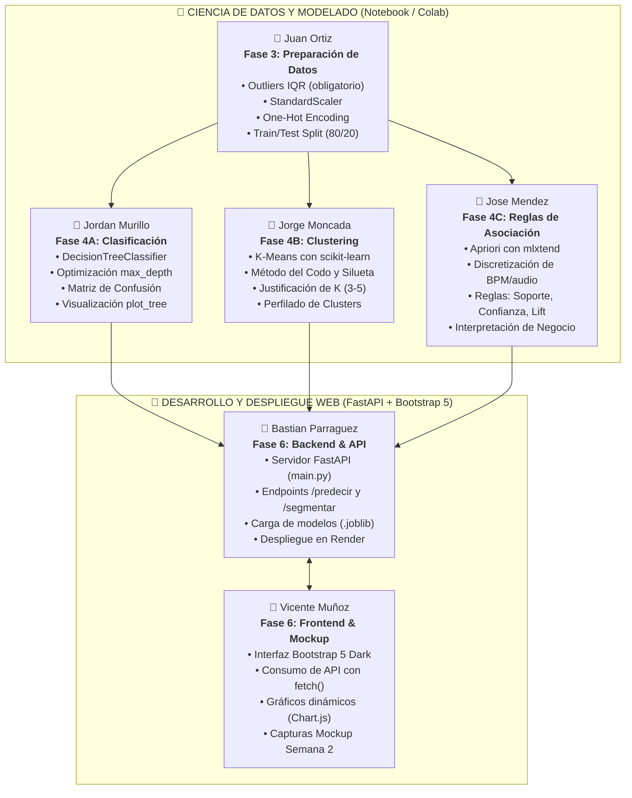
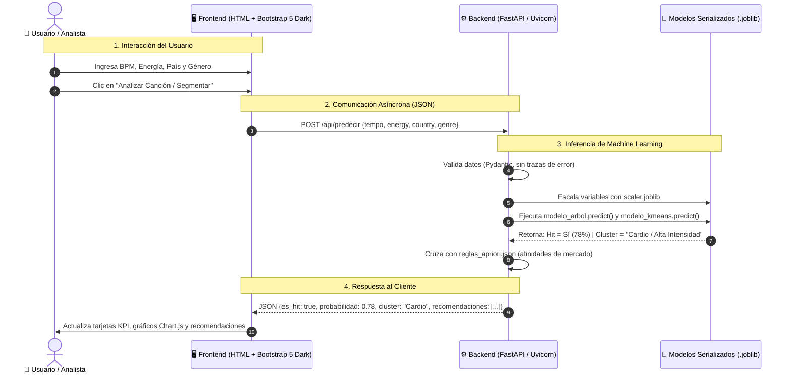

# SoundData Analytics: Segmentación de Audiencias Musicales y Predicción de Éxito
> **Metodología:** CRISP-DM | **Asignatura:** Minería de Datos (IEI-067) — Santo Tomás  
> **Dataset Base:** `spotify_2015_2025_85k.csv` (85.000 canciones, 19 atributos, 10 países y 12 géneros)

---

## 👥 Integrantes del Equipo y Distribución de Roles

| Integrante | Rol / Especialidad | Módulo CRISP-DM | Entregables Clave |
| :--- | :--- | :--- | :--- |
| **Juan Ortiz** | Líder de Datos y Preprocesamiento | **Fase 3: Preparación** | Limpieza de outliers con **IQR**, escalado `StandardScaler`, One-Hot Encoding y partición Train/Test (80/20). |
| **Jordan Murillo** | Modelado de Clasificación | **Fase 4A: Árbol de Decisión** | Entrenamiento de `DecisionTreeClassifier`, optimización de `max_depth` (evitar overfitting), matriz de confusión y exportación de `modelo_arbol.joblib`. |
| **Jorge Moncada** | Modelado de Clustering | **Fase 4B: K-Means** | Aplicación de K-Means, justificación de $K$ (Método del Codo y Silueta), caracterización de clusters y exportación de `modelo_kmeans.joblib`. |
| **Jose Mendez** | Reglas de Asociación | **Fase 4C: Apriori** | Discretización de variables acústicas (BPM), ejecución de Apriori con `mlxtend`, reporte de reglas ($Lift > 1.2$, $Conf \ge 60\%$) y `reglas_apriori.json`. |
| **Bastian Parraguez**| Desarrollador Backend | **Fase 6: API con FastAPI** | Servidor `app/main.py`, endpoints `/api/predecir` y `/api/segmentar`, validación de datos con Pydantic y configuración para Render (`Procfile`). |
| **Vicente Muñoz** | Desarrollador Frontend | **Fase 6: UI con Bootstrap 5** | Interfaz web interactiva en modo oscuro (Bootstrap 5 Dark), conexión cliente-servidor con `fetch()`, gráficos Chart.js y Mockup de Semana 2. |

---

## 📊 Diagrama 1: Flujo de Trabajo del Equipo (CRISP-DM + FullStack)



---

## 🏗️ Diagrama 2: Arquitectura del Sistema y Comunicación de Datos



---

## 📁 Estructura del Repositorio

```text
Proyecto-Mineria_Datos/
├── app/                                # Código de la aplicación web
│   ├── main.py                         # Servidor FastAPI y endpoints
│   ├── models/                         # Modelos entrenados (.joblib)
│   ├── static/                         # Estilos CSS y JavaScript
│   └── templates/                      # Plantilla HTML (Bootstrap 5 Dark)
├── data/                               # Dataset del proyecto
│   └── spotify_2015_2025_85k.csv       # 85.000 registros limpios en UTF-8
├── notebook/                           # Cuadernos Google Colab
│   └── Proyecto_Mineria_Datos.ipynb    # Código ejecutable con fases CRISP-DM
├── docs/                               # Documentación y pautas
│   └── Proyecto_MineriaDatos.pdf       # Pauta oficial de la asignatura
├── .gitignore                          # Exclusión de archivos temporales
├── requirements.txt                    # Dependencias Python
├── Procfile                            # Archivo de arranque para Render
└── README.md                           # Documentación central del proyecto
```

---

## 🎯 Resumen de Metas de Éxito de Machine Learning
* **Clasificación (Árbol de Decisión):** Accuracy $\ge 70\%$ con control de `max_depth` para prevenir sobreajuste (*overfitting*).
* **Clustering (K-Means):** Entre 3 y 5 grupos justificados mediante el Método del Codo y Coeficiente de Silueta.
* **Reglas de Asociación (Apriori):** Mínimo 3 reglas de negocio con Soporte $\ge 5\%$, Confianza $\ge 60\%$ y Lift $> 1.2$.
* **Despliegue Web:** Aplicación accesible 24/7 en Render con respuesta menor a 2 segundos y tolerancia a errores de entrada.
