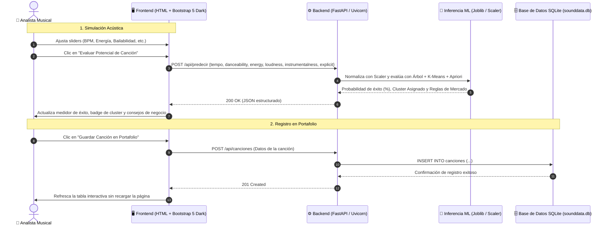

# SoundData Analytics: Segmentación de Audiencias Musicales y Predicción de Éxito
> **Metodología:** CRISP-DM | **Asignatura:** Minería de Datos (IEI-067) — Universidad Santo Tomás  
> **Dataset Base:** `spotify_2015_2025_85k.csv` (85.000 canciones, 17 atributos, 10 mercados y 12 géneros)

---

## 👥 Integrantes del Equipo y Distribución de Roles

| Integrante | Rol / Especialidad | Módulo CRISP-DM | Responsabilidades Clave |
| :--- | :--- | :--- | :--- |
| **Vicente Muñoz** | Coordinador & Full-Stack Lead | **Fase 6: Despliegue Web** | Arquitectura general, integración frontend Bootstrap 5 Dark, conexión API y coordinación de entregables. |
| **Juan Ortiz** | Ingeniero de Datos | **Fase 3: Preparación de Datos** | Limpieza y tratamiento de outliers con **IQR**, escalado estadístico `StandardScaler`, codificación y partición 80/20. |
| **Jordan Murillo** | Científico de Datos (Asociación) | **Fase 4A: Reglas Apriori** | Discretización de transacciones, ejecución de Apriori con `mlxtend`, filtrado de reglas ($Lift > 3.3$, $Conf \ge 60\%$) y serialización en `reglas_apriori.json`. |
| **Jorge Moncada** | Científico de Datos (Clustering) | **Fase 4B: K-Means** | Agrupamiento con Scikit-Learn, justificación de $K=4$ (Método del Codo y Coeficiente de Silueta) y caracterización de arquetipos sonoros. |
| **Jose Mendez** | Especialista Machine Learning | **Fase 4C: Árbol de Decisión** | Entrenamiento de `DecisionTreeClassifier`, optimización de `max_depth=3` para prevenir sobreajuste, matriz de confusión y `modelo_arbol.joblib`. |
| **Bastian Parraguez**| Ingeniero de QA y Despliegue | **Fase 6: Backend & Calidad** | Servidor FastAPI (`app/main.py`), persistencia SQLite (`app/database.py`), suite de pruebas unitarias (`pytest`) y configuración para Render (`Procfile`). |

---

## 📚 Documentación Oficial del Proyecto (Entregables)

- **[Informe Técnico Final en Word (Formato Académico)](docs/INFORME_TECNICO_FINAL_ACTUALIZADO.docx)**: Documento Word formal completo con todas las fases CRISP-DM, fórmulas matemáticas, gráficos científicos incrustados, tabla Jira y roles del equipo.
- **[Informe Técnico en Markdown](docs/INFORME_TECNICO_FINAL.md)**: Versión de lectura directa en el repositorio con estadísticas `.describe()`, tratamiento IQR, hiperparámetros y matriz de confusión.
- **[Presentación Parte 1: El Análisis CRISP-DM (PPTX)](docs/PARTE1_ANALISIS_SOUNDDATA_V2.pptx)**: Presentación ejecutiva de 9 diapositivas + 4 anexos ocultos con gráficos oscuros y guiones de orador.
- **[Presentación Parte 2: La Aplicación Web (PPTX)](docs/PARTE2_APLICACION_SOUNDDATA_V2.pptx)**: Presentación de 7 diapositivas + 1 anexo oculto con capturas en alta resolución y ciclo CRUD.
- **[Pauta de Correcciones Aplicada a Presentaciones](CORRECCIONES_PRESENTACIONES_SOUNDDATA.md)**: Auditoría de diseño, reglas tipográficas ($\ge 20$ pt, $\le 40$ palabras) y directivas aplicadas.
- **[Tablero de Tareas Jira](docs/TABLERO_JIRA.md)**: 18 historias de usuario y tareas técnicas repartidas equilibradamente.
- **[Diagramas de Arquitectura del Sistema](docs/DIAGRAMAS_ARQUITECTURA.md)**: Diagramas Mermaid de secuencia, flujo CRUD en SQLite y workflow de equipo.

---

## 🏗️ Arquitectura del Sistema y Comunicación de Datos



---

## 🚀 Guía de Instalación y Ejecución Local

### 1. Clonar el repositorio y acceder a la carpeta
```bash
git clone https://github.com/mkinaa/MineriaDatos.git
cd MineriaDatos
```

### 2. Crear y activar el entorno virtual
En Windows (PowerShell):
```powershell
python -m venv .venv
.\.venv\Scripts\Activate.ps1
```

En Linux / macOS:
```bash
python3 -m venv .venv
source .venv/bin/activate
```

### 3. Instalar las dependencias
```bash
pip install -r requirements.txt
```

### 4. Ejecutar la suite de pruebas unitarias
```bash
pytest -v
```
*(Debe reportar los 17 tests aprobados al 100%).*

### 5. Iniciar el servidor web local
```bash
uvicorn app.main:app --host 127.0.0.1 --port 8000 --reload
```
Abre tu navegador en: [http://127.0.0.1:8000](http://127.0.0.1:8000)

---

## 📁 Estructura del Repositorio

```text
Proyecto-Mineria_Datos/
├── app/                                # Aplicación web Full-Stack
│   ├── database.py                     # Gestión y persistencia transaccional SQLite
│   ├── main.py                         # API FastAPI, esquemas Pydantic y endpoints
│   ├── models/                         # Modelos y transformadores serializados
│   │   ├── modelo_arbol.joblib         # Árbol de decisión clasificador (max_depth=3)
│   │   ├── modelo_kmeans.joblib        # K-Means clustering (K=4)
│   │   ├── scaler.joblib               # StandardScaler entrenado sobre 6 features
│   │   └── reglas_apriori.json         # Reglas de asociación minadas con mlxtend
│   ├── static/                         # Estilos y recursos visuales
│   └── templates/
│       └── index.html                  # Interfaz Bootstrap 5 Dark 100% en español
├── data/
│   └── spotify_2015_2025_85k.csv       # Catálogo de 85.000 pistas
├── docs/                               # Documentación oficial de entrega
│   ├── INFORME_TECNICO_FINAL_ACTUALIZADO.docx # Informe técnico formal (Word)
│   ├── INFORME_TECNICO_FINAL.md        # Informe técnico oficial según CRISP-DM
│   ├── PARTE1_ANALISIS_SOUNDDATA_V2.pptx      # Presentación PPTX 1: Análisis CRISP-DM
│   ├── PARTE2_APLICACION_SOUNDDATA_V2.pptx    # Presentación PPTX 2: Aplicación Web
│   ├── versiones previas/              # Archivo de borradores PPTX anteriores
│   ├── TABLERO_JIRA.md                 # Historias de usuario y tareas por integrante
│   ├── DIAGRAMAS_ARQUITECTURA.md       # Diagramas técnicos en Mermaid
│   └── Proyecto_MineriaDatos.pdf       # Pauta y rúbrica oficial de la asignatura
├── notebook/
│   └── Proyecto_Mineria_Datos.ipynb    # Notebook Colab comentado línea por línea
├── tests/                              # Suite de pruebas unitarias con Pytest
│   ├── test_api.py                     # Tests de endpoints HTTP y validación
│   ├── test_database.py                # Tests del ciclo CRUD en SQLite
│   └── test_modelos.py                 # Tests de carga e inferencia de modelos
├── .gitignore
├── requirements.txt                    # Dependencias de producción y pruebas
├── Procfile                            # Archivo de despliegue para Render
└── README.md                           # Documentación principal
```
