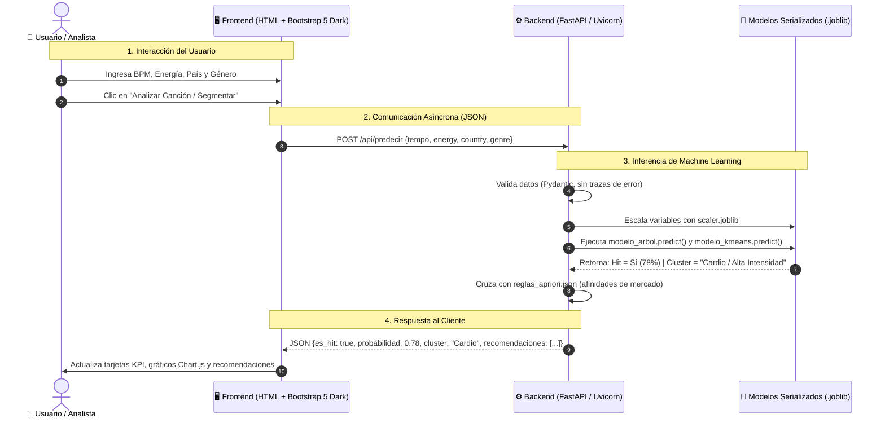
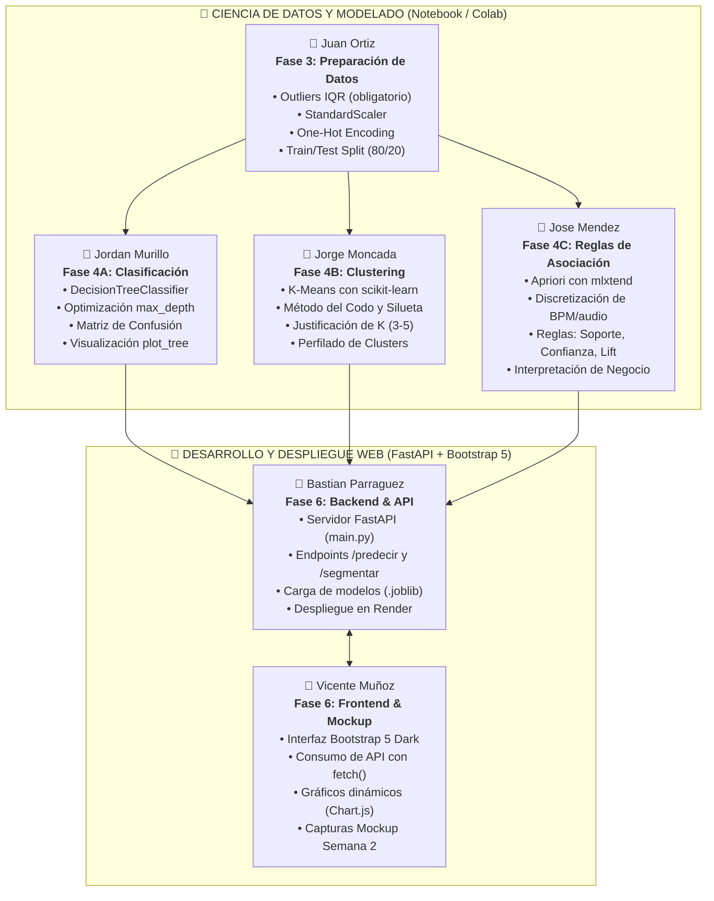

# Documentación de Arquitectura y Diagramas de Flujo
**Proyecto:** SoundData Analytics — Segmentación de Audiencias y Predicción de Éxito  
**Metodología:** CRISP-DM | **Semana 2: Prototipo y Modelado**

---

## 1. Diagrama de Arquitectura de la Aplicación (Frontend <-> Backend <-> Modelos)

Este diagrama responde formalmente al requerimiento de la **Sección 5.7** y la **Rúbrica de la Semana 2**:

---

## 2. Diagrama de Distribución de Trabajo del Equipo (6 Personas)

Garantiza que cada uno de los 6 integrantes tenga responsabilidades aisladas, entregables claros y commits verificables en GitHub:

