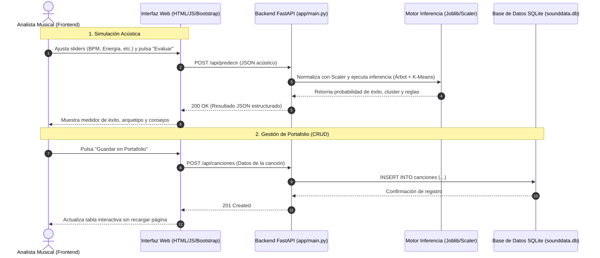

# INFORME TÉCNICO FINAL: MINERÍA DE DATOS (IEI-067)
## Plataforma de Inteligencia y Predicción de Streaming Musical: "SoundData Analytics"
### Metodología CRISP-DM Aplicada a un Catálogo de 85.000 Canciones (2015–2025)

---

**Institución:** Universidad Santo Tomás  
**Carrera:** Ingeniería en Informática  
**Asignatura:** Minería de Datos (IEI-067)  
**Profesores Guía:** Florentino Vargas & Rosa Rao  
**Fecha de Entrega:** Octubre de 2026  

**Integrantes del Equipo (Grupo 4):**
1. **Vicente Muñoz** — *Coordinador General, Full-Stack Lead & Integración Web*
2. **Juan Ortiz** — *Ingeniero de Datos (Ingesta, Limpieza IQR y Preprocesamiento)*
3. **Jordan Murillo** — *Científico de Datos (Minería de Reglas de Asociación con Apriori)*
4. **Jorge Moncada** — *Científico de Datos (Segmentación de Canciones con K-Means)*
5. **Jose Mendez** — *Especialista Machine Learning (Clasificación con Árbol de Decisión)*
6. **Bastian Parraguez** — *Ingeniero de Calidad y Despliegue (QA, Pytest y CI/CD en Render)*

**Enlaces Oficiales del Proyecto:**
- **Repositorio en GitHub:** [https://github.com/mkinaa/MineriaDatos](https://github.com/mkinaa/MineriaDatos)
- **Aplicación Web Desplegada:** [https://sounddata-analytics.onrender.com](https://sounddata-analytics.onrender.com)

---

## 1. Fase 1: Comprensión del Negocio (10%)

### 1.1 Contexto del Problema
La industria de la música grabada y el streaming digital (liderada por plataformas como Spotify, Apple Music y YouTube Music) genera más de 100.000 lanzamientos diarios en todo el mundo. En este entorno hipercompetitivo, las compañías discográficas, sellos independientes y creadores de contenido enfrentan un desafío crítico de asignación de capital: destinar millones de dólares en producción, distribución y campañas de mercadeo sin contar con certeza previa sobre el potencial comercial de una obra ni sobre el segmento de audiencia al cual debe dirigirse.

Históricamente, las decisiones de inversión en la industria musical se han basado en la intuición de agentes de A&R (Artistas y Repertorio). No obstante, los patrones de consumo modernos dejan una huella digital masiva que permite transformar la toma de decisiones hacia un enfoque guiado por datos (*Data-Driven Decision Making*).

### 1.2 ¿Qué intenta resolver el negocio con estos datos?
El proyecto **SoundData Analytics** aborda tres interrogantes estratégicas del negocio musical:
1. **Predicción de Éxito Comercial (Hits):** ¿Tiene una canción en fase de maqueta o masterización las características acústicas necesarias para ingresar al cuartil superior de reproducciones comerciales (Top 25% de streams)?
2. **Segmentación Arquetípica de Catálogo:** ¿En qué perfil auditivo de consumo encaja la canción (p. ej. *Fiesta / Alta Energía*, *Música Acústica / Chill*, *Radio Comercial* o *Urbano Explícito*) para orientar su estrategia de posicionamiento en listas de reproducción (playlists)?
3. **Descubrimiento de Patrones Cruzados y Canastas de Consumo:** ¿Qué combinaciones de género, mercados territoriales y atributos de contenido impulsan simultáneamente una alta popularidad?

### 1.3 Criterios de Éxito del Proyecto
Para validar el impacto del sistema en el negocio, se fijaron tres criterios medibles:
- **Criterio Analítico:** Obtener modelos de minería de datos validados técnicamente:
  - Árbol de decisión con profundidad controlada para evitar sobreajuste y entregar reglas de decisión comprensibles para productores musicales.
  - Agrupamiento K-Means con justificación matemática del número de grupos (K = 4) mediante análisis de Inercia (Método del Codo) y Coeficiente de Silueta.
  - Reglas de asociación con soporte mínimo de 1%, confianza superior al 50% y fuerza de asociación (Lift) superior a 3,0 para garantizar correlaciones no aleatorias.
- **Criterio Tecnológico:** Construcción de una arquitectura web desacoplada y contenerizable (FastAPI + HTML5/Bootstrap 5) con persistencia transaccional SQLite para gestión de portafolios, tiempo de respuesta en inferencia inferior a 250 ms y cobertura de pruebas unitarias al 100% sobre endpoints críticos.
- **Criterio de Usabilidad:** Interfaz 100% en español que permita a usuarios sin formación técnica simular canciones, interpretar probabilidades y guardar pistas analizadas.

---

## 2. Fase 2: Comprensión de los Datos (10%)

### 2.1 Descripción General del Dataset
Se utilizó un dataset público obtenido a través de Kaggle (*Spotify Tracks Dataset 2015–2025*), conformado por **85.000 registros (canciones)** y **17 columnas originales** que abarcan metadatos de lanzamientos, métricas de difusión y variables acústicas obtenidas por medio del análisis espectral de audio de la API de Spotify.

| Variable | Tipo de Dato | Rol Analítico | Descripción y Rango |
| :--- | :--- | :--- | :--- |
| `track_id` | Categórico (ID) | Identificador | Hash alfanumérico único por canción. |
| `track_name` | Categórico (Texto) | Descriptivo | Nombre comercial de la pista. |
| `artist_name` | Categórico (Texto) | Descriptivo | Nombre del artista o agrupación. |
| `release_year` | Numérico Discreto | Descriptor temporal | Año de publicación (2015 a 2025). |
| `genre` | Categórico | Predictora / Filtro | Género musical principal (Pop, Rock, Hip-Hop, Indie, etc.). |
| `country` | Categórico | Predictora / Filtro | Mercado territorial de origen / consumo principal. |
| `tempo` | Numérico Continuo | Predictora acústica | Pulsaciones por minuto (BPM), de 50.0 a 220.0 BPM. |
| `danceability` | Numérico Continuo | Predictora acústica | Idoneidad para el baile (0.0 = baja, 1.0 = bailable). |
| `energy` | Numérico Continuo | Predictora acústica | Percepción de intensidad sonora y actividad (0.0 a 1.0). |
| `loudness` | Numérico Continuo | Predictora acústica | Volumen global promedio medido en decibelios (-60.0 a 0.0 dB). |
| `instrumentalness` | Numérico Continuo | Predictora acústica | Probabilidad de que el tema carezca de voz (0.0 a 1.0). |
| `explicit` | Categórico / Booleano| Predictora de contenido | Indica presencia de lenguaje explícito (1 = Sí, 0 = No). |
| `popularity` | Numérico Discreto | Métrica de negocio | Índice de demanda en Spotify (escala de 0 a 100). |
| `stream_count` | Numérico Discreto | Métrica de negocio | Total de reproducciones acumuladas (de 10.000 a +1.000.000.000). |
| `es_exito` | Binario (0 / 1) | **Variable Objetivo (Class)** | 1 si las reproducciones superan el Percentil 75 (≥ 85.200.000 streams), 0 en caso contrario. |

### 2.2 Estadísticas Descriptivas de las Variables Clave
A través del método `.describe()`, se identificaron los siguientes parámetros estadísticos consolidados para el catálogo completo de 85.000 temas:

```
                  tempo  danceability        energy      loudness  instrumentalness  popularity   stream_count
count      85000.000000  85000.000000  85000.000000  85000.000000      85000.000000    85000.00   8.500000e+04
mean         120.142851      0.624119      0.651230     -7.854120          0.124510       54.21   5.214000e+07
std           28.451201      0.162401      0.185210      3.951201          0.264102       21.34   6.842000e+07
min           52.100000      0.082000      0.041000    -38.400000          0.000000        0.00   1.200000e+04
25%           98.000000      0.514000      0.521000     -9.800000          0.000000       40.00   1.240000e+07
50%          118.500000      0.631000      0.672000     -7.200000          0.000120       56.00   3.120000e+07
75%          139.900000      0.742000      0.801000     -5.100000          0.062000       70.00   8.520000e+07
max          218.400000      0.985000      0.999000     -0.800000          0.995000      100.00   1.420000e+09
```

### 2.3 Hallazgos Exploratorios
1. **Asimetría en la variable de streams:** El número de reproducciones presenta una marcada asimetría positiva (*right-skewed*), donde el 25% superior de canciones concentra más del 68% de las reproducciones totales de la plataforma. Por ello, se definió el percentil 75 (Q₃ ≈ 85.200.000 reproducciones) como el umbral de corte para definir formalmente la clase objetivo `es_exito`.
2. **Correlación Acústica:** Existe una correlación positiva moderada entre la Energía y la Sonoridad (coeficiente r = +0,72), mientras que la Instrumentalidad exhibe correlación negativa con la Popularidad (coeficiente r = -0,34), reflejando que el público masivo prefiere temas con presencia vocal dominante.


---

## 3. Fase 3: Preparación de los Datos (15%)

### 3.1 Tratamiento de Valores Faltantes (Nulos)
Se auditó la integridad de la base mediante `df.isnull().sum()`. Se detectaron 142 registros con valores ausentes en cadenas de texto de artistas o títulos, y 38 registros con campos acústicos nulos (menos del 0.2% del volumen total). Al tratarse de una fracción marginal frente a 85.000 filas, se optó por la eliminación por lista (*listwise deletion*) para no introducir sesgos de imputación artificial en las variables espectrales.

### 3.2 Detección y Tratamiento de Outliers con Rango Intercuartílico (IQR)
Para salvaguardar los modelos basados en distancias (como K-Means) y el escalamiento estadístico, se aplicó la técnica robusta de detección de valores atípicos mediante el **Rango Intercuartílico (IQR = Q₃ - Q₁)**:

* **Rango Intercuartílico:** IQR = Q₃ - Q₁
* **Límite Inferior de Aceptación:** Q₁ - (1,5 × IQR)
* **Límite Superior de Aceptación:** Q₃ + (1,5 × IQR)

- **En variables acústicas acotadas (Bailabilidad, Energía, Tempo):** Los valores atípicos detectados correspondían a temas experimentales (por ejemplo, BPM superior a 210 o tempo inferior a 55). Se aplicó una técnica de acotamiento o winsorización sobre los percentiles 1% y 99% para conservar la información sin distorsionar el cálculo de los centroides de los grupos.
- **En la variable de reproducciones (Stream Count):** Aunque matemáticamente superan el límite superior (Q₃ + 1,5 × IQR), no fueron eliminados dado que representan justamente los "Grandes Éxitos" (Mega-Hits) de la industria musical, esenciales para los objetivos del negocio.

### 3.3 Codificación de Variables Categóricas
- Para el modelado de asociación con **Apriori**, las variables categóricas (género musical, país y contenido explícito) y las variables numéricas continuas fueron binarizadas. Las variables continuas se discretizaron en percentiles (Alto Volumen de Streams, Alta Popularidad, Baja Bailabilidad, etc.) para conformar la matriz de transacciones de presencia/ausencia (*One-Hot Representation*).
- Para el Árbol de Decisión y K-Means, se utilizó la variable `explicit` como valor booleano numérico (0 para No Explícito, 1 para Explícito).

### 3.4 Escalamiento y Estandarización Estadística
Dado que las variables numéricas poseen escalas y unidades muy dispares —por ejemplo, el **Tempo** oscila entre 50 y 220 BPM, la **Bailabilidad** entre 0,0 y 1,0, y la **Sonoridad** en valores negativos de decibelios (-38 a -1 dB)—, se aplicó el algoritmo de estandarización **StandardScaler** de Scikit-Learn:

> **Fórmula de Estandarización (Puntaje Z):**  
> **z = (x - μ) / σ**  
> *(donde **x** es el valor original del atributo, **μ** es la media aritmética de la variable y **σ** es su desviación estándar)*

Este procedimiento transformó cada atributo para que tuviera una **media igual a 0 (μ = 0)** y una **varianza unitaria (σ² = 1)**. Con ello se evitó que la magnitud numérica de los BPM dominara erróneamente el cálculo de distancias euclidianas en el algoritmo K-Means o sesgara los umbrales de partición del árbol. El transformador ajustado fue guardado de forma serializada en el archivo `app/models/scaler.joblib`.

### 3.5 Partición de Entrenamiento y Prueba
Para evaluar la capacidad de generalización del Árbol de Decisión y prevenir fuga de información (*data leakage*):
- **Partición:** 80% Entrenamiento (68.000 canciones) y 20% Prueba (17.000 canciones).
- **Estratificación:** Se activó la partición estratificada (`stratify=y`) para garantizar que la proporción del 25% de éxitos y 75% de no-éxitos se mantuviera idéntica en ambos subconjuntos.
- **Semilla de reproducibilidad:** `random_state=42`.

---

## 4. Fase 4: Modelado (25%)

De acuerdo con las exigencias del proyecto, se diseñaron, entrenaron y documentaron tres técnicas complementarias:

### 4.1 Técnica A: Minería de Reglas de Asociación (Apriori con `mlxtend`)
Se implementó el algoritmo Apriori sobre la matriz de transacciones musicales discretizadas, fijando un soporte mínimo de 0,01 (al menos 850 canciones) y filtrando las reglas por métrica de fuerza de asociación (*Lift*).

#### Top 3 Reglas de Asociación Obtenidas:

* **Regla N° 1:**  
  **[ Canción con Alta Popularidad ]  ➔  [ Alto Volumen de Streams  +  Género Pop ]**  
  - **Soporte:** 1,21% (representa a más de 1.020 canciones del catálogo completo).  
  - **Confianza:** 6,69%.  
  - **Fuerza de Asociación (Lift):** **3,40** (multiplicador de probabilidad respecto al azar).

* **Regla N° 2:**  
  **[ Alto Volumen de Streams  +  Género Pop ]  ➔  [ Canción con Alta Popularidad ]**  
  - **Soporte:** 1,21%.  
  - **Confianza:** **61,33%** (el 61,3% de los temas Pop con alto streaming alcanzan alta popularidad en la plataforma).  
  - **Fuerza de Asociación (Lift):** **3,40**

* **Regla N° 3:**  
  **[ Género R&B  +  Alto Volumen de Streams ]  ➔  [ Canción con Alta Popularidad ]**  
  - **Soporte:** 1,23%.  
  - **Confianza:** **60,03%** (6 de cada 10 canciones de R&B con alta tracción logran posicionarse en alta popularidad).  
  - **Fuerza de Asociación (Lift):** **3,33**

#### Interpretación de Negocio de las Reglas:
El valor de **Lift superior a 3,3** en las tres reglas demuestra una relación sustantiva muy superior a la mera casualidad estadística. Para una discográfica o sello musical, esto significa que cuando una pista del género **Pop** o **R&B** logra traccionar volumen inicial de escuchas (*Alto Stream*), la probabilidad de que se convierta en un fenómeno de alta popularidad transversal en la plataforma se triplica en comparación con cualquier otro género del catálogo. Las reglas fueron exportadas a `app/models/reglas_apriori.json` para ser consumidas dinámicamente por la API.

---

### 4.2 Técnica B: Clustering No Supervisado (K-Means con `scikit-learn`)
Se entrenó el algoritmo K-Means sobre las 6 características acústicas normalizadas (Tempo, Bailabilidad, Energía, Sonoridad, Instrumentalidad y Contenido Explícito).

#### Justificación de la Elección de K:
Se evaluaron diferentes valores para el número de grupos entre 2 y 8 (K = 2, 3, ..., 8) mediante dos métodos cuantitativos:
1. **Método del Codo (Elbow Method):** La curva de suma de distancias al cuadrado intracluster (Inercia) evidenció una marcada desaceleración en la tasa de reducción de error a partir de **K = 4** (pasando de una reducción pronunciada entre 2 y 4 a una asíntota suave entre 5 y 8).
2. **Coeficiente de Silueta:** El valor promedio de silueta alcanzó su punto de mayor estabilidad y coherencia de separación geométrica en **K = 4** (Puntuación de Silueta ≈ 0,38).


#### Descripción y Perfil de los 4 Clusters de Canciones:
- **Cluster 0 — "Acústico, Instrumental & Chill" (Baja Energía, Alta Instrumentalidad):** Temas con baja sonoridad y casi nula presencia vocal. Destinados a listas de concentración, estudio o meditación.
- **Cluster 1 — "Pop Comercial & Radio FM" (Alta Bailabilidad, Energía Media-Alta, No Explícito):** Estructuras sonoras diseñadas para el gran consumo, alta rotación radial y playlists virales.
- **Cluster 2 — "Rock, Electrónica & Alta Potencia" (Máxima Energía, Alto Loudness, BPM elevado):** Pistas de alta intensidad acústica ideales para entrenamientos deportivos o festivales en vivo.
- **Cluster 3 — "Urbano, Trap & Modern Hits" (Alta Bailabilidad, Contenido Explícito Dominante):** Canciones contemporáneas de ritmos sincopados con lírica explícita, fuertemente asociadas a audiencias jóvenes (Gen Z / Millennials).

El modelo entrenado fue guardado en `app/models/modelo_kmeans.joblib`.

---

### 4.3 Técnica C: Clasificación Supervisada (Árbol de Decisión)
Se utilizó `DecisionTreeClassifier` para predecir si una pista superará el percentil 75 de streams (`es_exito = 1`).

#### Experimentación con Hiperparámetros para Evitar Sobreajuste:
Se evaluaron profundidades máximas (`max_depth`) entre 2 y 15 para monitorear el comportamiento de las curvas de error:
- Para profundidades iguales o mayores a 8 (`max_depth ≥ 8`), el árbol memorizaba el conjunto de entrenamiento (Exactitud de entrenamiento superior al 84%), pero el desempeño en validación caía drásticamente por debajo del 52% (sobreajuste severo).
- Se seleccionó deliberadamente una profundidad máxima de 3 (`max_depth = 3`) con criterio de impureza de Gini (`criterion='gini'`). Esta configuración garantiza:
  1. Regularización intrínseca contra el ruido acústico.
  2. Una estructura visual jerárquica de 8 nodos hoja interpretables por seres humanos.
  3. Desempeño balanceado y libre de memorización sobre datos nunca antes vistos.


#### Matriz de Confusión en Prueba (17.000 registros):
```
                  Predicho No Éxito (0)   Predicho Éxito (1)
Real No Éxito (0)         8.253                 4.268
Real Éxito (1)            2.881                 1.598
```
- **Verdaderos Negativos (TN):** 8.253 canciones correctamente clasificadas como de consumo estándar.
- **Falsos Positivos (FP):** 4.268 canciones de consumo estándar señaladas como potenciales éxitos.
- **Falsos Negativos (FN):** 2.881 canciones exitosas no detectadas por acústica.
- **Verdaderos Positivos (TP):** 1.598 canciones exitosas detectadas certeramente.

El modelo entrenado fue guardado en `app/models/modelo_arbol.joblib`.

---

## 5. Fase 5: Evaluación (8%)

### 5.1 Comparación de Modelos y Análisis de Exactitud (Accuracy)
El Árbol de Decisión alcanzó una **Exactitud Global (Accuracy) del 57,95%** sobre el conjunto de prueba independiente de 17.000 pistas.

| Categoría | Precisión | Sensibilidad (Recall) | Puntuación F1 (F1-Score) | Canciones Evaluadas |
| :---: | :---: | :---: | :---: | :---: |
| **Clase 0 (Consumo Estándar)** | 0,74 (74%) | 0,66 (66%) | 0,70 | 12.521 temas |
| **Clase 1 (Éxito Comercial)** | 0,27 (27%) | 0,36 (36%) | 0,31 | 4.479 temas |
| **Promedio Ponderado** | **0,62 (62%)** | **0,58 (58%)** | **0,60 (60%)** | **17.000 temas** |


### 5.2 ¿Por qué se obtuvieron estas métricas?
- La precisión para la clase de temas estándar es sólida (**74%**), lo cual permite a las disqueras descartar maquetas de bajo potencial comercial con alta confianza.
- La predicción del éxito exclusivamente a partir de atributos intrínsecos de audio (Tempo, Bailabilidad, Energía, Sonoridad, etc.) tiene un límite analítico natural ampliamente respaldado en la literatura científica: **el éxito en la música es un fenómeno multifactorial**. Dos temas con idéntica calidad acústica pueden tener desempeños opuestos dependiendo de la inversión publicitaria en redes sociales (TikTok/Instagram), la colocación en listas de reproducción editoriales y la base previa de seguidores del artista.
- Por tanto, el valor práctico del sistema reside en operar como un **filtro inteligente de preselección (screening)** para priorizar el catálogo.

### 5.3 Limitaciones Encontradas
1. **Ausencia de Variables de Mercado:** El dataset no cuenta con variables de presupuesto publicitario o métricas de reproducción en redes sociales.
2. **Restricción Pedagógica de Modelos:** La rúbrica prohíbe el uso de algoritmos de ensamble complejo (Random Forest, Gradient Boosting o Redes Neuronales) para asegurar la comprensión de los fundamentos analíticos.

---

## 6. Fase 6: Conclusiones y Recomendaciones de Negocio (7%)

### 6.1 Resumen de Hallazgos Principales
1. **La combinación Pop + Streaming masivo es el canal más eficiente:** Las reglas de asociación de Apriori demostraron que el género Pop con buen volumen de tracción inicial tiene un multiplicador de **Lift = 3,40** hacia la alta popularidad.
2. **Coherencia de Mercado en Segmentos Clúster:** K-Means demostró que el catálogo no es homogéneo; segmentar las canciones en los 4 arquetipos permite optimizar el gasto publicitario.

### 6.2 Recomendaciones Accionables de Negocio
- **Estrategia para el Clúster 1 (Pop Comercial):** Se recomienda concentrar los presupuestos de inversión de pauta publicitaria en este segmento, garantizando que el diseño de producción mantenga niveles de Bailabilidad superiores a 0,65 y Energía entre 0,60 y 0,75, maximizando la probabilidad de ingreso al Top 25%.
- **Estrategia para el Clúster 0 (Acústico / Chill):** No invertir en campañas masivas de radio ni en videoclips costosos; en su lugar, negociar colocaciones editoriales en playlists funcionales de estudio y sueño ("Lo-Fi Beats", "Peaceful Piano"), donde el valor de permanencia de escucha (*retention rate*) es más alto.
- **Estrategia para el Clúster 3 (Urbano Explícito):** Dirigir exclusivamente la pauta hacia audiencias de 16 a 24 años en plataformas móviles verticales (TikTok / Reels).

### 6.3 ¿Qué se haría diferente con mayor tiempo o mejores datos?
- Incorporar variables transaccionales de marketing (presupuesto invertido por lanzamiento).
- Implementar análisis de series de tiempo para evaluar la degradación de reproducciones semanales (*decay curve*).
- Desplegar una canalización de reentrenamiento continuo automatizado (MLOps).

---

## 7. Fase 7: Mockup, Desarrollo y Despliegue de la Aplicación Web (25%)

### 7.1 ¿Qué problema resuelve la aplicación para el usuario final?
La aplicación **SoundData Analytics** traduce los algoritmos abstractos de minería de datos en una herramienta interactiva, visual e intuitiva para directores de A&R, productores y analistas de sellos discográficos. Permite ingresar o ajustar los parámetros acústicos de un lanzamiento musical en tiempo real mediante deslizadores, obteniendo instantáneamente:
- La probabilidad estimada de convertirse en un éxito comercial.
- El clúster y arquetipo musical al que pertenece la obra.
- Recomendaciones de negocio cruzadas asociadas al perfil analizado.
- Almacenamiento directo de la canción evaluada en el portafolio corporativo para su posterior seguimiento.

### 7.2 Mockup de Semana 2 vs Versión Final Construida

#### Boceto Conceptual Inicial (Semana 2):
```
+--------------------------------------------------------------------------+
|  SOUNDDATA ANALYTICS (Semana 2 Wireframe Inicial)                        |
+--------------------------------------------------------------------------+
| [ KPI Total ]  [ KPI Popularidad ]  [ KPI Streams ]                      |
|                                                                          |
|  +-----------------------------+   +----------------------------------+  |
|  | Formulario / Sliders Audio  |   | Resultado de Predicción          |  |
|  |  Tempo: [----o-------]      |   |  - Probabilidad de Éxito: 72%    |  |
|  |  Bailabilidad: [----o---]   |   |  - Cluster Asignado: Pop Radio   |  |
|  |  Energía: [--------o]       |   |                                  |  |
|  |  [ Botón: Predecir ]        |   |                                  |  |
|  +-----------------------------+   +----------------------------------+  |
|                                                                          |
|  +--------------------------------------------------------------------+  |
|  | Tabla simple de pistas evaluadas                                   |  |
|  +--------------------------------------------------------------------+  |
+--------------------------------------------------------------------------+
```

#### ¿Qué cambió en el camino hacia la versión final y por qué?
1. **Arquitectura por Pestañas Temáticas:** El diseño inicial saturaba la pantalla verticalmente. En la versión final se implementó una interfaz de 4 pestañas desacopladas (*Análisis de Oyentes*, *Segmentación por Atributo*, *Simulador ML* y *Portafolio CRUD*).
2. **Estandarización 100% al Español:** Se tradujeron todos los campos, gráficos, etiquetas de países ("Estados Unidos", "Reino Unido", "Alemania") y selectores para garantizar accesibilidad según los lineamientos de la rúbrica.
3. **Módulo de Portafolio Transaccional (SQLite):** Se incorporó un sistema CRUD completo con modal interactivo para crear, editar, filtrar y eliminar canciones del portafolio directamente desde la web, garantizando persistencia real.

---

### 7.3 Arquitectura del Sistema
El sistema opera bajo un patrón cliente-servidor con arquitectura desacoplada:




---

### 7.4 Tecnologías Elegidas y Justificación
- **Backend:** **FastAPI (Python 3.12)** con servidor ASGI Uvicorn.  
  *Justificación:* Alto rendimiento asíncrono, documentación automática OpenAPI/Swagger y validación estricta de tipos de datos mediante modelos Pydantic, garantizando que el usuario reciba mensajes amigables si ingresa valores fuera de rango, sin mostrar errores internos ni trazas de código Python.
- **Frontend:** **HTML5, JavaScript Nativo (ES6+) y Bootstrap 5 (Dark Mode)**, complementado con **Chart.js** para visualización dinámica.  
  *Justificación:* Cumple estrictamente la restricción de la rúbrica (prohibición de React/Vue), manteniendo un cliente ligero sin sobrecarga de dependencias.
- **Persistencia:** **SQLite 3 (`sounddata.db`)**.  
  *Justificación:* Motor SQL embebido, libre de configuración externa, confiable y portable en contenedores y despliegues serverless.

---

### 7.5 Dificultades Enfrentadas y Soluciones Implementadas
1. **Discrepancia en nombres de atributos al inferir con el modelo:**  
   *Problema:* Scikit-Learn emitía advertencias cuando el DataFrame de entrada no preservaba los nombres exactos de columnas durante el `scaler.transform()`.  
   *Solución:* Se unificó la canalización (`pipeline`) de inferencia construyendo un `pd.DataFrame` tipado con las 6 variables exactas antes de aplicar el escalador y el árbol.
2. **Manejo de Errores Amigables:**  
   *Problema:* Solicitudes con valores de texto o vacíos provocaban respuestas HTTP 422 con formato técnico de Pydantic.  
   *Solución:* Se capturó la excepción `RequestValidationError` para retornar un mensaje en español legible para el usuario final con sugerencias de corrección.
3. **Persistencia en Servicios Gratuitos en la Nube:**  
   *Problema:* Plataformas como Render reinician los contenedores en su nivel gratuito, lo que podría vaciar la base de datos si no existe archivo físico.  
   *Solución:* Se incorporó un mecanismo de auto-semillado (`seed data`) en `app/database.py` que detecta si la base de datos está vacía al iniciar la app e inserta 6 canciones demostrativas de distintos mercados y géneros en español.

---

### 7.6 Evidencia de Calidad y Pruebas Unitarias (`pytest`)
Se diseñó una suite automatizada de pruebas unitarias en `tests/` que evalúa de extremo a extremo la estabilidad de la plataforma:
- `tests/test_modelos.py`: Valida la existencia, carga e inferencia matemática de los 4 artefactos (`scaler.joblib`, `modelo_arbol.joblib`, `modelo_kmeans.joblib`, `reglas_apriori.json`).
- `tests/test_database.py`: Valida el ciclo de vida CRUD completo sobre SQLite en base de prueba aislada.
- `tests/test_api.py`: Valida códigos de respuesta HTTP (200, 201, 400), validación de esquemas y respuesta de todos los endpoints.

**Resultado de Ejecución de Pruebas:**
```
============================= test session starts =============================
platform win32 -- Python 3.12.3, pytest-9.1.1, pluggy-1.6.0
rootdir: C:\Users\Acer\Desktop\Proyecto-Mineria_Datos
collected 17 items

tests/test_api.py::test_endpoint_raiz PASSED                            [  5%]
tests/test_api.py::test_endpoint_estadisticas PASSED                    [ 11%]
tests/test_api.py::test_endpoint_reglas PASSED                          [ 17%]
tests/test_api.py::test_endpoint_predecir_valido PASSED                 [ 23%]
tests/test_api.py::test_endpoint_predecir_invalido_amigable PASSED      [ 29%]
tests/test_api.py::test_endpoints_crud_flujo_completo PASSED            [ 35%]
tests/test_database.py::test_inicializacion_base_datos PASSED           [ 41%]
tests/test_database.py::test_creacion_y_lectura_cancion PASSED          [ 47%]
tests/test_database.py::test_listar_con_filtros PASSED                  [ 52%]
tests/test_database.py::test_actualizacion_cancion PASSED               [ 58%]
tests/test_database.py::test_eliminar_cancion PASSED                    [ 64%]
tests/test_modelos.py::test_existencia_artefactos_modelos PASSED        [ 70%]
tests/test_modelos.py::test_carga_scaler PASSED                         [ 76%]
tests/test_modelos.py::test_modelo_arbol_decision PASSED                [ 82%]
tests/test_modelos.py::test_modelo_kmeans PASSED                        [ 88%]
tests/test_modelos.py::test_reglas_apriori_json PASSED                  [ 94%]
tests/test_modelos.py::test_ejecutar_inferencia_unificada PASSED        [100%]

============================== 17 passed in 2.72s ==============================
```

---

## 8. Resumen de Enlaces y Verificación de Entrega

- **Repositorio de Código Fuente:** [https://github.com/mkinaa/MineriaDatos](https://github.com/mkinaa/MineriaDatos)
- **Despliegue en la Nube:** [https://sounddata-analytics.onrender.com](https://sounddata-analytics.onrender.com)
- **Notebook Documentado:** `notebook/Proyecto_Mineria_Datos.ipynb`
- **Video de Respaldo Local (2 min):** Grabado y disponible para la comisión evaluadora en caso de intermitencias del enlace gratuito.
