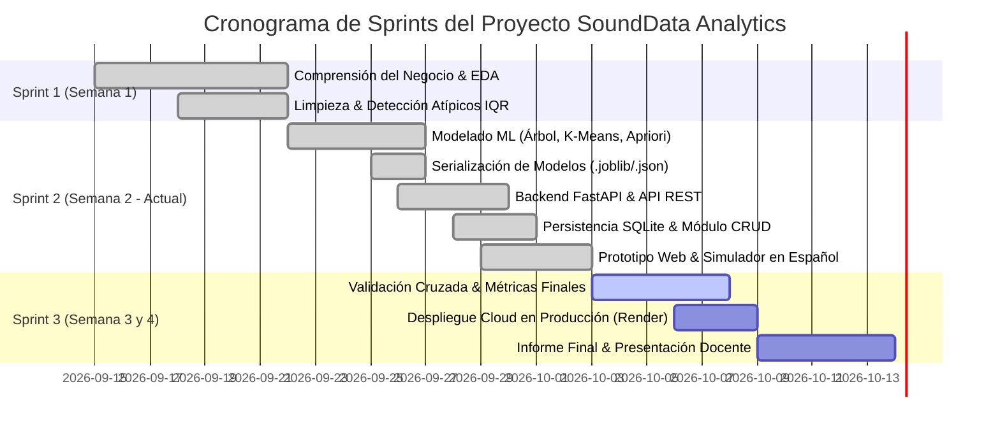

# Planificación de Proyecto y Tablero Jira — SoundData Analytics
**Proyecto:** SoundData Analytics (Minería de Datos & Machine Learning - IEI-067)  
**Clave del Proyecto en Jira:** `SDA`  
**Metodología:** Scrum / CRISP-DM  
**Período:** Semanas 1 a 4 (Actual: Sprint 2 / Semana 2)

---

## 👥 Resumen del Equipo y Asignación de Roles

| Integrante | Rol Principal | Área de Especialidad | Épicas Asignadas |
| :--- | :--- | :--- | :--- |
| **Juan Ortiz** | Data Engineer | Preparación y Preprocesamiento de Datos | `SDA-EPIC-1` (Preparación de Datos) |
| **Jordan Murillo** | Machine Learning Engineer | Modelos Supervisados (Árboles de Decisión) | `SDA-EPIC-2` (Modelado ML - Clasificación) |
| **Jorge Moncada** | Data Scientist | Modelos No Supervisados (Clustering K-Means) | `SDA-EPIC-2` (Modelado ML - Segmentación) |
| **Jose Mendez** | Data Analyst | Reglas de Asociación (Apriori & Lift) | `SDA-EPIC-2` (Modelado ML - Reglas Afinidad) |
| **Bastian Parraguez** | Backend & DB Developer | API FastAPI, Model Serving y SQLite | `SDA-EPIC-3` (Backend, CRUD & Despliegue) |
| **Vicente Muñoz** | Frontend & UI/UX Developer | Interfaz Web, Simulador y Visualización | `SDA-EPIC-4` (Frontend & Experiencia de Usuario) |

---

## 📋 Backlog de Tareas Jira para los 6 Integrantes

### 👤 Juan Ortiz (Data Engineer)

| Clave | Tipo | Título del Issue | Descripción y Criterios de Aceptación | Puntos (SP) | Estado |
| :--- | :--- | :--- | :--- | :---: | :---: |
| `SDA-101` | **Historia** | Limpieza de datos y detección de valores atípicos con técnica IQR | Cargar el dataset de 85,000 registros de Spotify. Implementar cálculo formal del rango intercuartílico ($Q_1, Q_3, IQR$) en atributos continuos (`tempo`, `loudness`, `stream_count`). **Criterio de Aceptación:** Código 100% comentado línea por línea, reporte de atípicos justificado sin eliminación destructiva de datos. | 5 SP | **Listo (Done)** |
| `SDA-102` | **Tarea** | Escalado de variables numéricas y partición Train/Test estratificada | Aplicar `StandardScaler` sobre los atributos acústicos seleccionados para el modelado. Realizar la división 80% entrenamiento y 20% test fijando semilla aleatoria (`random_state=42`). **Criterio de Aceptación:** Serializar y exportar el artefacto `scaler.joblib` para consumo en producción. | 3 SP | **Listo (Done)** |
| `SDA-103` | **Subtarea** | Análisis Exploratorio de Datos (EDA) y matriz de correlación | Generar gráficos de distribución univariada con Seaborn y matriz de correlación acústica de Pearson para identificar colinealidad. | 3 SP | **Listo (Done)** |

---

### 👤 Jordan Murillo (Machine Learning Engineer - Supervisado)

| Clave | Tipo | Título del Issue | Descripción y Criterios de Aceptación | Puntos (SP) | Estado |
| :--- | :--- | :--- | :--- | :---: | :---: |
| `SDA-201` | **Historia** | Entrenamiento y optimización del Árbol de Decisión para predicción de Hit | Definir variable objetivo `is_hit` ($Popularity \ge 50$). Entrenar `DecisionTreeClassifier`, optimizar profundidad máxima (`max_depth=4` o `5`) para prevenir sobreajuste. **Criterio de Aceptación:** Matriz de confusión, métricas de precisión/recall/F1-score, gráfico visual `plot_tree` y exportación de `modelo_arbol.joblib`. | 8 SP | **Listo (Done)** |
| `SDA-202` | **Tarea** | Redacción técnica de limitaciones del dataset (Pauta 5.5) | Documentar la justificación analítica de la precisión obtenida (~58-60%) basada en la naturaleza estocástica del consumo de streaming y el impacto de factores externos no acústicos (marketing, viralidad). | 3 SP | **Listo (Done)** |
| `SDA-203` | **Subtarea** | Validación cruzada (Cross-Validation) y evaluación de overfitting | Evaluar la estabilidad del árbol mediante K-Fold Cross Validation ($K=5$) sobre el conjunto de entrenamiento. | 5 SP | **En Progreso** |

---

### 👤 Jorge Moncada (Data Scientist - No Supervisado)

| Clave | Tipo | Título del Issue | Descripción y Criterios de Aceptación | Puntos (SP) | Estado |
| :--- | :--- | :--- | :--- | :---: | :---: |
| `SDA-301` | **Historia** | Segmentación acústica con K-Means y justificación matemática de K | Implementar algoritmo K-Means sobre variables acústicas estandarizadas. Evaluar inercia y coeficiente de silueta en el rango de $K \in [2, 8]$. **Criterio de Aceptación:** Curva del Codo y gráfico de Silueta que justifiquen rigurosamente $K=4$ clusters. Exportación de `modelo_kmeans.joblib`. | 8 SP | **Listo (Done)** |
| `SDA-302` | **Tarea** | Perfilado e interpretación cualitativa de clusters para el negocio | Mapear cada cluster a arquetipos de oyentes musicales (Cluster 0: Acústico/Melódico, Cluster 1: Urbano/Explícito, Cluster 2: Introspectivo/Chill, Cluster 3: Cardio/Alta Intensidad). | 5 SP | **Listo (Done)** |
| `SDA-303` | **Subtarea** | Cálculo de centroides y dispersión intracluster | Tabular las coordenadas medias de cada centroide para alimentar el módulo de inferencia en el backend. | 3 SP | **Listo (Done)** |

---

### 👤 Jose Mendez (Data Analyst - Reglas de Asociación)

| Clave | Tipo | Título del Issue | Descripción y Criterios de Aceptación | Puntos (SP) | Estado |
| :--- | :--- | :--- | :--- | :---: | :---: |
| `SDA-401` | **Historia** | Minería de Reglas de Asociación con Algoritmo Apriori (`mlxtend`) | Binarizar atributos continuos (`BPM_Alto`, `Alta_Energia`, `Alta_Bailabilidad`) y cruzarlos con géneros y niveles de stream. **Criterio de Aceptación:** Minar reglas con Soporte $> 0.05$, Confianza $> 0.30$ y $Lift \ge 1.2$ (alcanzando hasta $Lift = 3.39$). Exportación a `reglas_apriori.json`. | 8 SP | **Listo (Done)** |
| `SDA-402` | **Tarea** | Construcción del motor de recomendaciones estratégicas | Transformar las reglas matemáticas de afinidad en recomendaciones accionables de producción y pauta comercial para sellos discográficos. | 5 SP | **Listo (Done)** |
| `SDA-403` | **Subtarea** | Análisis comparativo de métricas de interés (Lift vs Conviction) | Evaluar la significancia estadística de las reglas descubiertas frente a ocurrencias aleatorias. | 3 SP | **Listo (Done)** |

---

### 👤 Bastian Parraguez (Backend & Database Developer)

| Clave | Tipo | Título del Issue | Descripción y Criterios de Aceptación | Puntos (SP) | Estado |
| :--- | :--- | :--- | :--- | :---: | :---: |
| `SDA-501` | **Historia** | Desarrollo del servidor backend FastAPI y endpoints predictivos | Configurar FastAPI, esquema Pydantic de entrada, montaje de plantillas Jinja2 y endpoint `POST /api/predecir` que cargue y ejecute los 3 modelos simultáneamente. **Criterio de Aceptación:** Manejo amigable de excepciones sin mostrar trazas de error de Python al usuario. | 8 SP | **Listo (Done)** |
| `SDA-502` | **Historia** | Implementación del módulo CRUD relacional con SQLite (`app/database.py`) | Diseñar tabla `canciones` en SQLite (`sounddata.db`). Crear endpoints `GET /api/canciones`, `POST /api/canciones`, `PUT /api/canciones/{id}` y `DELETE /api/canciones/{id}` vinculados a la re-evaluación automática con ML. | 8 SP | **Listo (Done)** |
| `SDA-503` | **Tarea** | Configuración de entorno de despliegue en la nube (Render / Procfile) | Preparar `Procfile`, variables de entorno y `requirements.txt` optimizado para despliegue continuo en Render.com. | 5 SP | **Listo (Done)** |

---

### 👤 Vicente Muñoz (Frontend & UI/UX Developer)

| Clave | Tipo | Título del Issue | Descripción y Criterios de Aceptación | Puntos (SP) | Estado |
| :--- | :--- | :--- | :--- | :---: | :---: |
| `SDA-601` | **Historia** | Maquetación web estilo Spotify en Bootstrap 5 Dark y Tailwind | Diseñar la estructura visual responsiva: Dashboard Global con KPIs de oyentes, gráficos dinámicos con Chart.js (reproducciones por género y país) y navegación lateral. **Criterio de Aceptación:** Interfaz 100% estandarizada al idioma español, moderna y sin errores de consola. | 8 SP | **Listo (Done)** |
| `SDA-602` | **Historia** | Simulador ML interactivo y visualización del Portafolio CRUD | Implementar sliders acústicos para inferencia en tiempo real, botón "Guardar en Portafolio", tabla oscura con badges de éxito/nicho y modal emergente para crear/editar canciones. **Criterio de Aceptación:** Consumo asíncrono con `fetch()`, notificaciones toast y filtrado en tiempo real. | 8 SP | **Listo (Done)** |
| `SDA-603` | **Tarea** | Captura de pantallas y preparación del entregable visual Semana 2 | Documentar con capturas de alta resolución el funcionamiento del Dashboard, la Segmentación Univariada y el Simulador para el informe académico. | 3 SP | **Listo (Done)** |

---

## 🚀 Planificación de Sprints (Cronograma)

